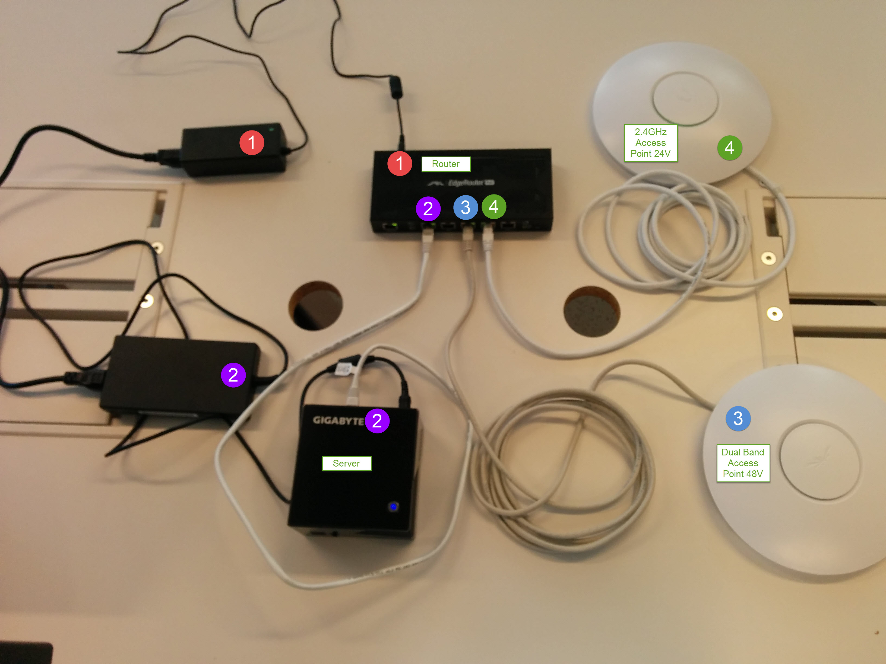

# DHIS2 Academy FAQ and tips

## Credentials

If you have a DHIS2 Academy server from earlier than `21.05.2016` these credentials might be different, check the folder named 'OldConfig' or the documents you recieved with the server.
This is the standard configuration. Remember to update if there are more DHIS2 instances etc.

Service                          | Format                     | Credentials
-------------------------------- | -------------------------- | --------------------------------
Ubuntu Server (logon/ssh)        | username:password          | dhisadmin:dhis
Postgres root                    | command                    | sudo -u postgres psql postgres
DHIS2 instance and database name | name                       | dhis
Moodle admin user                | username:password          | admin:DHIS4ever!
Moodle Postgres                  | username:database:password | moodleuser:moodle:dhis
Router Admin                     | username:password          | ubnt:ubnt
UniFi controller                 | username:password          | dhis:dhis
WiFi                             | SSID (no password)         | dhis2

## General Information

- Server IP: 192.168.1.2
  - Can ssh to it using `ssh dhisadmin@192.168.1.2`.
- Domain: dhis.academy
- Access server through <http://192.168.1.2> or <http://dhis.academy>
- Router admin panel can be accessed through <http://192.168.1.1>
- Web content is located at `/var/www/`
- Clients (connected via WiFi or on port eth4) will be on the 192.168.2.0/24 subnet.

### Logs

- Postgresql: `/var/log/postgresql-9.3-main.log`
- DHIS2: `/var/lib/dhis2/<instance name>/logs/*`
- Nginx: `/var/log/nginx/*`
- Router and access point logs can be downloaded by running `./StandardConfig/getLogs.sh`. This will ask for the passwords of the devices the logs will be downloaded from, check the [credentials](#credentials).

You can also look at the log of a DHIS2 instance by using `dhis2-logtail <instance name>` or `dhis2-logview <instance name>`

### Equipment

**The equipment will be marked with numbers, it is important that only the matching numbers are connected!**

Equipment                                     | Marked
--------------------------------------------- | -----:
EdgeRouter PoE, including power adapter (48V) |     #1
Server, including power adapter				  |     #2
WiFi Access Point Dual Band                   |     #3
WiFi Access Point 2.4GHz                      |     #4
Ethernet cables x3                            |      -

**All of the equipment is marked with numbers, only connect the corresponding numbers so that the equipment is not damaged.**



## Server
 - Shut the server down using `sudo poweroff`
 - Reboot server `sudo reboot`

### Server not reachable
 - If the server is not reachable (especially after powercut):
   1. Log in to the routers admin panel `http://192.168.1.1`. See [Credentials](#credentials) for login info.
   2. Check the color of the port `eth0`. If it is purple, you may want to unplug the power (and the ethernet cables) and let the router "rest" a few minutes before plugging it in again.
 - Check that the server has not automatically connected to a WiFi network.

### Restart programs
 - Postgres: `sudo service postgresql restart`
   - Should be used when you get a "Database connection failed"
 - Nginx: `sudo service nginx restart`
 - DNS: `sudo service bind9 restart`

## DHIS2
 - DHIS2 instances will automatically start when the server starts.
 - You can check available man pages with `apropos dhis`

### Start and stop instance
 - Start: `dhis2-startup <instance name>`
 - Shut down: `dhis2-shutdown <instance name>`

### Restore a database to a DHIS2 instance
It is possible to use an existing database for a DHIS2 instance. Sample databases can be found at the [dhis2 download page](https://www.dhis2.org/downloads). Restore the database before deploying a WAR file.

  ```bash
  wget https://www.dhis2.org/download/resources/2.23/dhis2-demo.zip
  unzip dhis2-demo.zip
  dhis2-restoredb dhis demo.sql
  dhis2-startup dhis
  ```

### Backup of a database
There is a cronjob running for every instance that will automatically make backups over time, but to do it manually:
  ```bash
  sudo su <instance name>
  dhis2-backup
  exit
  ```

## Nginx
 - You can start and stop Nginx by using `sudo service nginx {start|stop|restart}`
   - If you want to change the Nginx configuration, edit `/etc/nginx/sites-available/academy.conf`, then relod the settings
   - Reload setting by running `sudo service nginx reload`

 - The Nginx splash page is located at `/var/www/index.html`, this can be edited to your liking.

## Router
### Network not accessible
**This should happen automatically when restarting the Router, but I will leave it in just in case**
If the network is not accessible (WiFi access point blinking), try releasing all the DHCP leases. To do so:
 1. Login to the router (<http://192.168.1.1>) with the provided [credentials](#credentials).
 2. Access the command line terminal (CLI) at the top right corner. Enter the router login [credentials](#credentials) again, and type: `clear dhcp leases`.
 3. The network can be restarted to be sure.

## Moodle
### Change upload size
The max upload size in Moodle is by default very low, this needs to be changed in multiple places to increase it. This guide will set the max upload size to 250MB. Edit the following files:
1. In `/etc/php5/fpm/php.ini` set the following parameters:
  - `post_max_size = 250M`
  - `upload_max_filesize = 250M`
Restart php by running `sudo service php5-fpm restart`
2. Change `Client_max_body_size 250M;` in the Nginx configuration, this is set to 250MB if you used the provided configuration. Change it in `/etc/nginx/sites-available/academy.conf` and reload the settings by running `sudo service nginx reload`.
3. You also have to change it in the Moodle settings:
  - Go to: Site admin -> Security -> Site policies. Change "maximum uploaded file size".
  - Go to: Site admin -> Plugins -> Activity modules -> assignments -> Submission plugins -> File submissions. Change the max upload size.
